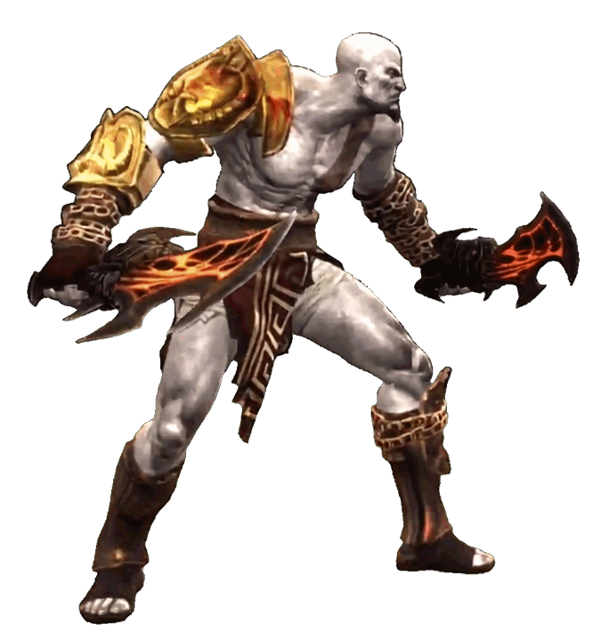

# Kratos (God of War)

---

## Información

- **Personaje:** Kratos  
- **Origen:** Saga *God of War*  
- **Versión del personaje:** Basado en la versión de **Mortal Kombat 9**  
- **Autor del proyecto:** Mugen's World  
- **Estado:** En desarrollo (etapa muy temprana)

---

## Descripción

Este proyecto busca recrear a **Kratos**, el Dios de la Guerra de la saga *God of War*, como un personaje jugable para **MUGEN**.

Esta versión del personaje está basada en el **Kratos jugable de Mortal Kombat 9**, utilizando sprites derivados de esa versión del personaje.

Actualmente el proyecto se encuentra en una **fase muy temprana de desarrollo**, enfocándose principalmente en la creación de los **sprites base del personaje**, comenzando con la animación de **stand**.

---

## Desarrollo

El personaje se está desarrollando utilizando **sprites derivados de Mortal Kombat 9**, adaptados para su uso dentro del motor **MUGEN**.

El desarrollo actual incluye:

- Preparación de sprites
- Creación de animaciones base
- Adaptación al formato de MUGEN

Es posible que el desarrollo del personaje utilice como base **código derivado de otros personajes de Kratos existentes en MUGEN**, el cual será modificado y expandido para este proyecto.

Si se utilizan recursos de otros autores, los créditos correspondientes serán añadidos.

---

## Créditos

**Autor del proyecto**

- Mugen's World

---

## Estado del proyecto

🚧 Proyecto en desarrollo temprano

Actualmente el personaje se encuentra en una **fase muy inicial**, incluyendo:

- Preparación de sprites
- Animación base (stand)
- Desarrollo de movimientos
- Implementación de mecánicas de combate

---

## Filosofía del proyecto

Este proyecto sigue el espíritu de la comunidad **MUGEN**:

> MUGEN es de la comunidad para la comunidad.

---

## Uso y distribución

Este proyecto es completamente libre para la comunidad.

Se permite:

- Usar el personaje
- Modificarlo
- Crear versiones derivadas
- Integrarlo en otros proyectos

No existen restricciones de uso.

Bajo ninguna circunstancia este contenido debe venderse.

---

## Futuro del proyecto

Planes a futuro para el personaje:

- Animaciones completas
- Movimientos inspirados en God of War
- Uso de las **Blades of Chaos**
- Ataques especiales y combos
- Posibles ataques basados en Mortal Kombat 9
